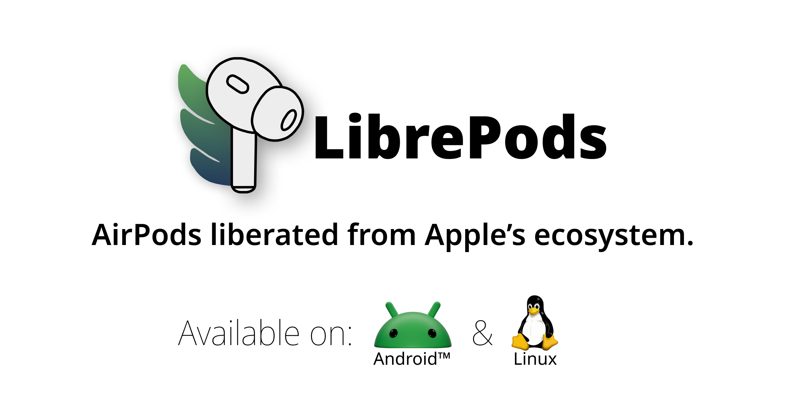

<picture>
  <source media="(prefers-color-scheme: dark)" srcset="./imgs/banner-dark.png" />
  <source media="(prefers-color-scheme: light)" srcset="./imgs/banner.png" />
  
</picture>

<div align="center" style="margin: 16px 0px;">
  <a href="https://github.com/librepods-org/librepods/releases/latest">
    
  </a>
  <a href="https://github.com/librepods-org/librepods/issues">
    
  </a>
  <a href="https://discord.gg/HhG4ycVum4">
    
  </a>
</div>

# What is LibrePods?

**LibrePods** liberates Apple AirPods features on non-Apple platforms. By implementing Apple's proprietary **AACP** (L2CAP) and **ATT** Bluetooth protocols, LibrePods brings native controls—such as Noise Cancellation, Transparency, Adaptive Audio, In-Ear Detection, Battery Telemetry, Head Gestures, and Conversational Awareness—to Android and Linux.

---

## 🚀 Improvements & Fixes in this Fork

This patchset hardens stability, eliminates background crashes, optimizes performance, and adds new rootless controls:

- 🛡️ **Single-Bud Battery Safety:** Resolved multiple `KotlinNullPointerException` crashes in `AirPodsService` when connecting with a single earbud or prior to full telemetry delivery.
- 🔌 **Bluetooth Socket Reflection Resilience:** Corrected uninitialized socket file descriptors (`fd = -1`) and introduced a dynamic constructor fallback resolver for L2CAP sockets across Android versions.
- 🔊 **Charging Case Sounds Toggle (Rootless):** Implemented native toggle support for AirPods Pro 2 and AirPods 4 ANC charging case chimes (`IN_CASE_TONE_CONFIG` 0x31 over AACP).
- ⚡ **Background Performance & Battery Optimization:** Removed high-frequency notification updates inside the raw Bluetooth socket reader loop, preventing SystemUI thrashing and reducing CPU wakeups.
- 🎚️ **Media Controller Calculation Fix:** Corrected default conversational awareness volume calculation (`* 0.4` instead of `/ 0.4`).
- 🔒 **Native Bridge & ProGuard Hardening:** Added early hidden API exemption loading in `LibrePodsApplication` and preserved native JNI bridges in ProGuard/R8.

---

## Feature Matrix

| Feature | Linux | Android | Notes |
| :--- | :---: | :---: | :--- |
| **Noise Control (ANC / Transparency / Adaptive / Off)** | ✅ | ✅ | Full rootless control via AACP |
| **In-Ear Detection & Auto-Pause** | ✅ | ✅ | Sub-second reaction over AACP |
| **Battery Status & Dynamic Island View** | ✅ | ✅ | Left, Right, and Case telemetry |
| **Conversational Awareness** | ✅ | ✅ | Auto volume ducking on speech |
| **Charging Case Sounds** | 🔴 | ✅ | Rootless toggle for case speaker |
| **Stem & Swipe Controls** | 🔴 | ✅ | Click intervals, swipe volume |
| **Head Gestures (Nod / Shake to answer/decline)** | ⛔ | ✅ | Sensor-driven on Android |
| **Loud Sound Reduction & Hearing Aid Tuning** | 🔴 | ⚪ | Requires VendorID spoofing (Apple `0x004C`) |
| **Multi-Device Seamless Switching** | ⚪ | ⚪ | Requires VendorID spoofing |

> **Key:** ✅ Supported Rootlessly | ⚪ Requires VendorID spoofing (Root/Xposed on Android) | 🔴 Planned | ⛔ Not Applicable

---

## 🛠️ Building & Installing

### Android (Gradle)
```bash
cd android
./gradlew assembleFossDebug
```
The APK will be generated at `android/app/build/outputs/apk/foss/debug/app-foss-debug.apk`.

### Linux (Rust)
```bash
cd linux
cargo build --release
```

---

## 📖 Protocols & References
- Wireshark Dissector by [@pabloaul](https://github.com/pabloaul): [apple-wireshark](https://github.com/pabloaul/apple-wireshark)
- Protocol definition by [@tyalie](https://github.com/tyalie): [AAP-Protocol-Definition](https://github.com/tyalie/AAP-Protocol-Defintion)

---

## ⚖️ License & Trademarks

- **License:** Distributed under the [GNU General Public License v3.0](LICENSE).
- **Trademarks:** *AirPods*, *AirPods Pro*, *AirPods Max*, and Apple logos are trademarks of Apple Inc. LibrePods is an independent open-source project and is not affiliated with or endorsed by Apple Inc.
